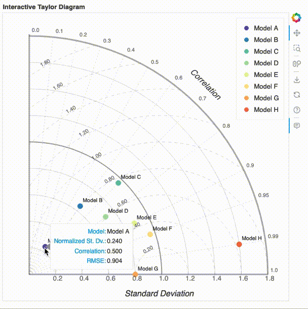

# ESMBenchmarkViz

ESMBenchmarkViz is a Python-based interactive visualization tool built with Bokeh, designed to facilitate the collective evaluation, intercomparison, and benchmarking of Earth System Models (ESMs). The tool provides a user-friendly interface for analyzing model performance, enabling researchers to make informed comparisons and insights into ESM behavior.

### Interactive Taylor Diagram

